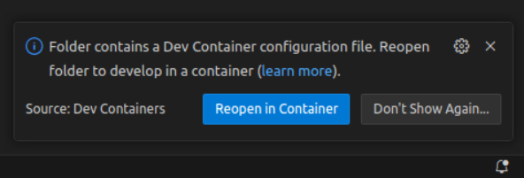
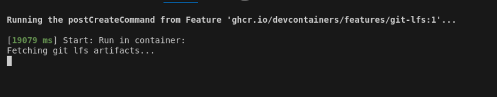
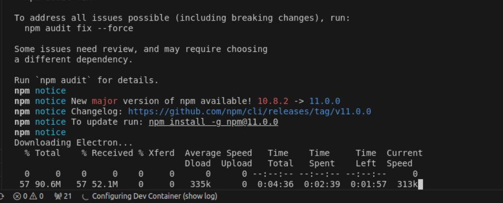
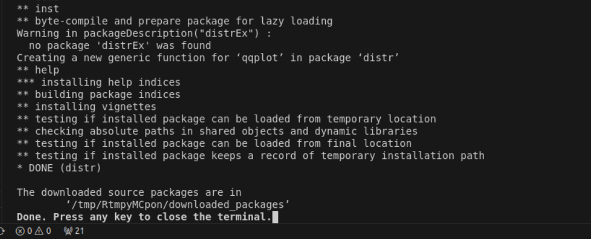
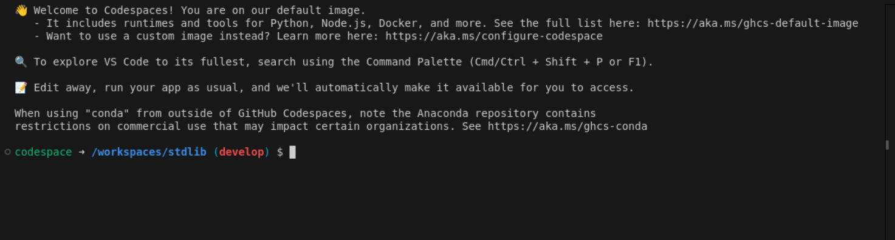

<!--

@license Apache-2.0

Copyright (c) 2025 The Stdlib Authors.

Licensed under the Apache License, Version 2.0 (the "License");
you may not use this file except in compliance with the License.
You may obtain a copy of the License at

   http://www.apache.org/licenses/LICENSE-2.0

Unless required by applicable law or agreed to in writing, software
distributed under the License is distributed on an "AS IS" BASIS,
WITHOUT WARRANTIES OR CONDITIONS OF ANY KIND, either express or implied.
See the License for the specific language governing permissions and
limitations under the License.

-->

# Devcontainer Setup

> Step-by-step tutorial on how to set up a stdlib development environment in a dev container.

## Introduction

We appreciate your interest in contributing to stdlib! Below, we've provided a step-by-step tutorial on how to set up the project locally on your device using a dev container.

Dev containers are Docker containers that are specifically configured to provide a fully featured development environment with the right tooling, extensions, linting and formatting. They allow you to open any folder inside (or mounted into) a container and take advantage of Visual Studio Code's full feature set.

The stdlib repository includes a preconfigured dev container, making it the easiest way to set up your development environment. It ensures proper linting, EditorConfig, and tooling are configured right from the start.

**Note:** The dev container does not yet support ARM64 architectures. For more information, or if you're interested in adding ARM64 support, you can visit this [issue][devcontainer-issue].

### Prerequisites

Setting up the stdlib dev container **requires** the following prerequisites:

-   [Git][git]: Version control
-   [Docker][docker]: Containerization
-   [VS Code][vscode]: Preferred IDE

### Download

To acquire the source code, first navigate to the parent directory where you want to place the project's [Git][git] repository.

<!-- run-disable -->

```bash
$ cd /path/to/parent/destination/directory
```

Next, clone the repository.

<!-- run-disable -->

```bash
$ git clone https://github.com/stdlib-js/stdlib.git
```

If you are wanting to contribute to stdlib, first [fork][github-fork] the repository and amend the previous command.

<!-- run-disable -->

```bash
$ git clone https://github.com/<username>/stdlib.git
```

Open the repository in VS Code.

```bash
$ cd stdlib && code .
```

When prompted, open the repository in the dev container.


<div class="image" align="center">
        
    <br>
</div>

Please be patient, as the post-create script may take some time to install all the required languages and dependencies.

<div class="image" align="center">
        
    <br>
</div>

Close the terminal and wait for other dependencies to install.

<div class="image" align="center">
        
    <br>
</div>

<div class="image" align="center">
        
    <br>
</div>

Close the terminal after the installation is completed.

<div class="image" align="center">
        
    <br>
</div>

If you see this when you open the terminal, then the dev container installation was successful!

<div class="image" align="center">
        
    <br>
</div>

<section class="links">

[git]: http://git-scm.com/

[docker]: https://www.docker.com/

[vscode]: https://code.visualstudio.com/

[devcontainer-issue]: https://github.com/stdlib-js/stdlib/issues/4934

[github-fork]: https://help.github.com/articles/fork-a-repo/

</section>

<!-- /.links -->
